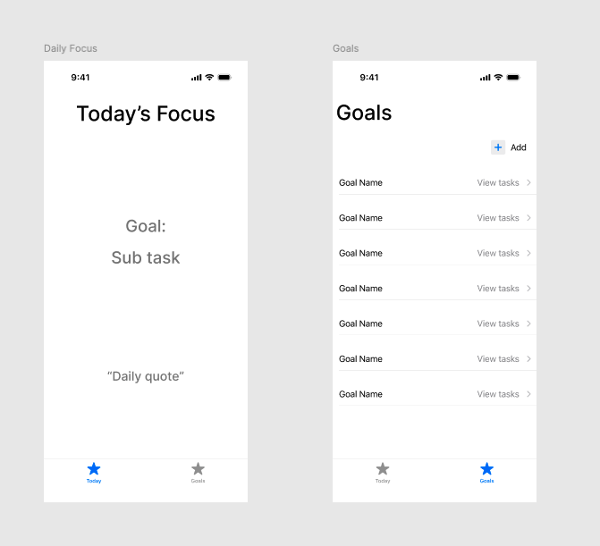

# Daily Slice

## Demo 

    <a href="https://www.loom.com/share/e87e8b9771b94f1c8c2a7a7eb7a2f61d">
      
Loom Message - 12 August 2025 - Watch Video

    </a>
    
  

  This app is still a work in progress that requires more iterations to have the idea fully developed

## Table of Contents

1. [Overview](#Overview)
2. [Product Spec](#Product-Spec)
3. [Wireframes](#Wireframes)
4. [Schema](#Schema)

## Overview

### Description

Daily Slice is a goal achieving assistant that aims to help reduce the overwhelming feeling of working towards big goals. Daily Slice selects a sub task that works towards a bigger goal and sends daily reminders to the user to complete their task of the day.  
### App Evaluation

- **Category:** Productivity and Lifestyle 
- **Mobile:** The app is designed to have quick decision support on the go. Users are able to view their goals, break them down into smaller tasks, and have a daily selected focus task. 
- **Story:** This app was inspired by the daily feeling of decision fatigue when managing personal goals. Goals are easier achieved through breaking down goals into smaller tasks and Daily Slice relieves the feeling of decision fatigue by selecting the focus for the day. Daily progress encourages momentum and motivate users to continue working towards their goals. 
- **Market:** This app is targeted towards students, young adults, and ambitious individuals who need assistance in managing their goals without feeling overwhelmed. The market for this app is broad as anyone can benefit from daily assistance and reminders. 
- **Habit:** Daily Slice encourages a daily habit in checking their notifcations or opening the app to see their focus for the day. This daily routine encourages progress and builds momentum towards their larger goals. 
- **Scope:** For the MVP users can:
    - Enter their personal goals
    - Break down the goal into smaller tasks
    - View their daily suggested task 
    - Mark tasks as complete

## Product Spec

### 1. User Stories (Required and Optional)

**Required Must-have Stories**

* User can view their large goals 
* User can add sub tasks to each large goal
* User can view their daily suggested task
* User can mark their task as complete

**Optional Nice-to-have Stories**

* Users can add energy level to tasks and tasks can be generate based on those levels
* Users can self select task for the day
* Users can view a progress bar towards their goals 

### 2. Screen Archetypes

- [X] Tab: List of large goals 
* User can view their large goals 
* User can add/delete larger goals
* User can mark their task as complete
* Note: only sample goals are visible, WIP

- [X] Detail: List of sub tasks associated with a larger goal 
* User can add/delete sub tasks to each large goal
* User can mark their task as complete
* Note: page is only visible, only sample cells for subtasks currently

- [X] Tab: Daily task
* User can view their daily suggested task
* Note: UI completed, WIP

### 3. Navigation

**Tab Navigation** (Tab to Screen)

* Daily task 
* List of personal goals 

**Flow Navigation** (Screen to Screen)

- [ ] List of personal goals 
* -> Sub tasks associated with larger personal goal 
    * -> add/ edit subtask 
* -> Add/edit/delete personal goal 

## Wireframes

### [BONUS] Digital Wireframes & Mockups

### [BONUS] Interactive Prototype

## To be completed: 

## Schema 

[This section will be completed in Unit 9]

### Models

[Add table of models]

### Networking

- [Add list of network requests by screen ]
- [Create basic snippets for each Parse network request]
- [OPTIONAL: List endpoints if using existing API such as Yelp]
